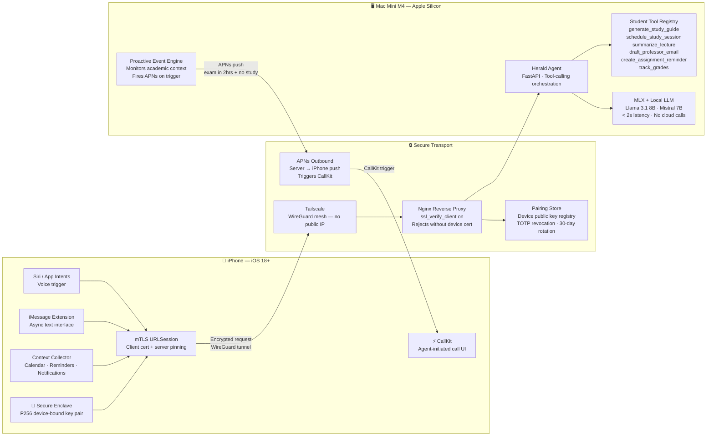
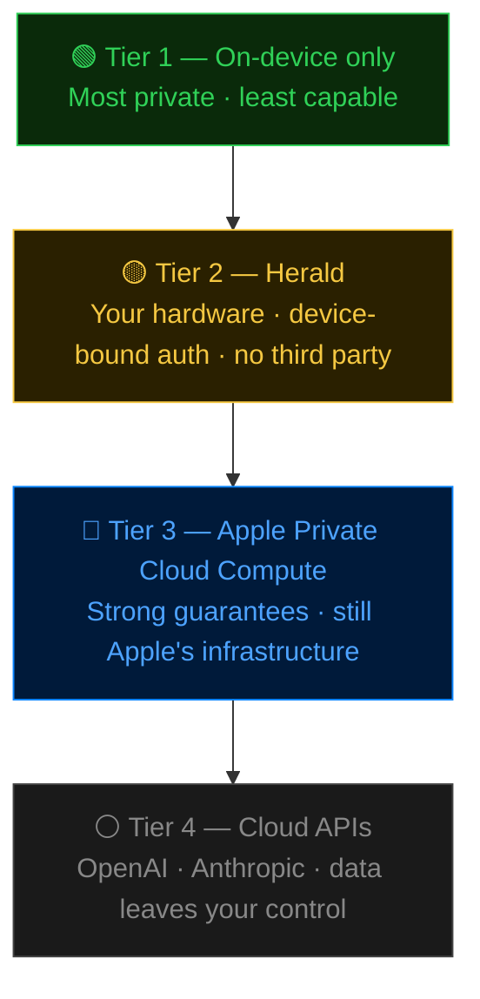
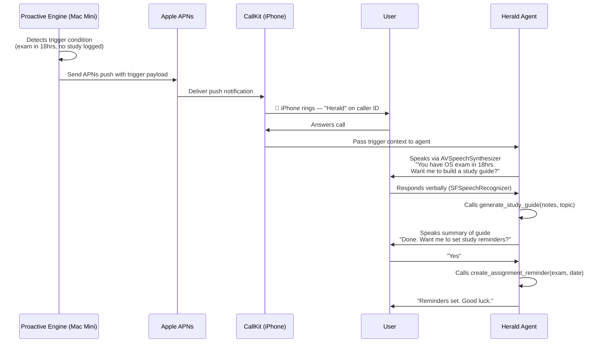
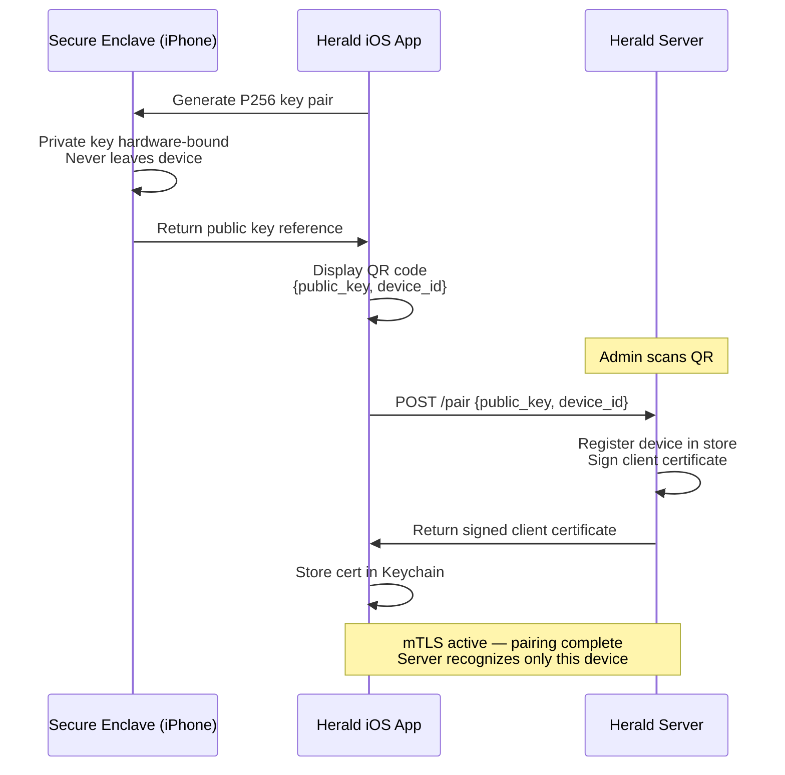

# Herald — System Architecture

```mermaid
flowchart LR
    subgraph iPhone["📱 iPhone — iOS 18+"]
        direction TB
        CK["⚡ CallKit\nAgent-initiated call UI"]
        SI["Siri / App Intents\nVoice trigger"]
        IM["iMessage Extension\nAsync text interface"]
        CC["Context Collector\nCalendar · Reminders · Notifications"]
        SE["🔐 Secure Enclave\nP256 device-bound key pair"]
        MT["mTLS URLSession\nClient cert + server pinning"]
    end

    subgraph Transport["🔒 Secure Transport"]
        direction TB
        TS["Tailscale\nWireGuard mesh — no public IP"]
        NX["Nginx Reverse Proxy\nssl_verify_client on\nRejects without device cert"]
        AP["APNs Outbound\nServer → iPhone push\nTriggers CallKit"]
        PC["Pairing Store\nDevice public key registry\nTOTP revocation · 30-day rotation"]
    end

    subgraph MacMini["🖥 Mac Mini M4 — Apple Silicon"]
        direction TB
        AG["Herald Agent\nFastAPI · Tool-calling orchestration"]
        TR["Student Tool Registry\ngenerate_study_guide\nschedule_study_session\nsummarize_lecture\ndraft_professor_email\ncreate_assignment_reminder\ntrack_grades"]
        PE["Proactive Event Engine\nMonitors academic context\nFires APNs on trigger"]
        LM["MLX + Local LLM\nLlama 3.1 8B · Mistral 7B\n< 2s latency · No cloud calls"]
    end

    MT -->|"Encrypted request\nWireGuard tunnel"| TS
    TS --> NX
    NX --> AG
    AG --> TR
    AG --> LM
    PE -->|"APNs push\nexam in 2hrs + no study"| AP
    AP -->|"CallKit trigger"| CK

    SE --> MT
    CC --> MT
    SI --> MT
    IM --> MT
    NX --> PC
```

---

## Privacy Hierarchy

```mermaid
graph TD
    A["🟢 Tier 1 — On-device only\nMost private · least capable"]
    B["🟡 Tier 2 — Herald\nYour hardware · device-bound auth · no third party"]
    C["🔵 Tier 3 — Apple Private Cloud Compute\nStrong guarantees · still Apple's infrastructure"]
    D["⚪ Tier 4 — Cloud APIs\nOpenAI · Anthropic · data leaves your control"]

    A --> B --> C --> D

    style A fill:#0a2a0a,stroke:#30d158,color:#30d158
    style B fill:#2a2000,stroke:#f5c842,color:#f5c842
    style C fill:#001a3a,stroke:#0a84ff,color:#4da3ff
    style D fill:#1a1a1a,stroke:#444,color:#888
```

---

## Proactive Call Flow — The Wow Feature

```mermaid
sequenceDiagram
    participant PE as Proactive Engine (Mac Mini)
    participant AP as Apple APNs
    participant CK as CallKit (iPhone)
    participant US as User
    participant AG as Herald Agent

    PE->>PE: Detects trigger condition<br/>(exam in 18hrs, no study logged)
    PE->>AP: Send APNs push with trigger payload
    AP->>CK: Deliver push notification
    CK->>US: 📱 iPhone rings — "Herald" on caller ID
    US->>CK: Answers call
    CK->>AG: Pass trigger context to agent
    AG->>US: Speaks via AVSpeechSynthesizer<br/>"You have OS exam in 18hrs.<br/>Want me to build a study guide?"
    US->>AG: Responds verbally (SFSpeechRecognizer)
    AG->>AG: Calls generate_study_guide(notes, topic)
    AG->>US: Speaks summary of guide<br/>"Done. Want me to set study reminders?"
    US->>AG: "Yes"
    AG->>AG: Calls create_assignment_reminder(exam, date)
    AG->>US: "Reminders set. Good luck."
```

---

## Pairing Ceremony — First Launch

```mermaid
sequenceDiagram
    participant SE as Secure Enclave (iPhone)
    participant APP as Herald iOS App
    participant SRV as Herald Server

    APP->>SE: Generate P256 key pair
    SE->>SE: Private key hardware-bound<br/>Never leaves device
    SE->>APP: Return public key reference
    APP->>APP: Display QR code<br/>{public_key, device_id}
    Note over SRV: Admin scans QR
    APP->>SRV: POST /pair {public_key, device_id}
    SRV->>SRV: Register device in store<br/>Sign client certificate
    SRV->>APP: Return signed client certificate
    APP->>APP: Store cert in Keychain
    Note over APP,SRV: mTLS active — pairing complete<br/>Server recognizes only this device
```
